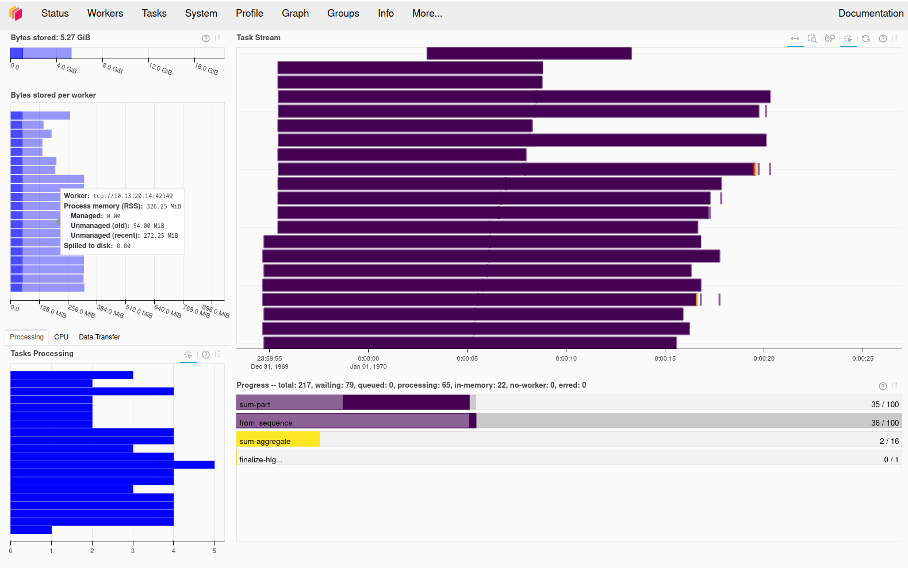
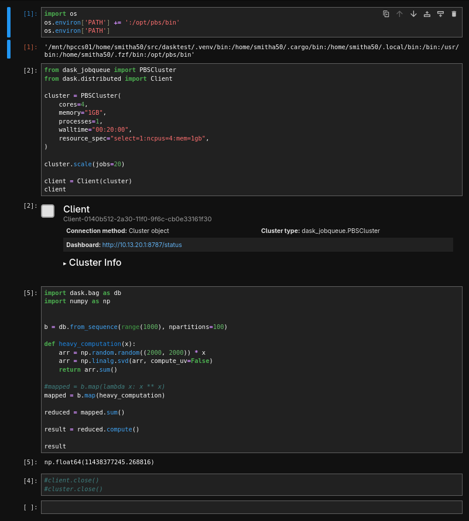

# Dask on Aqua

Using Dask in an interactive Jupyter notebook on QUT's Aqua, to run distributed jobs on a PBS cluster.

See the [notebook](main.ipynb)





## Instructions

### Setup

Install [uv](https://github.com/astral-sh/uv) to run Python

Clone this repository:

```bash
git clone https://github.com/eresearchqut/dasktest.git
```

### Interactive job

Start an interactive job to run the Jupyter notebook:

```bash
qsub -I -l walltime=08:00:00 -l select=1:ncpus=8:mem=32gb
```

Get the name of the host running the interactive job (eg. `cpu1n001`):

```bash
echo $HOSTNAME
```

Change in to the directory containing this repository, and start the jupyter lab server:

```bash
# cd ~/src/dasktest
uv run jupyter lab --ip 0.0.0.0
```

In another terminal, port-forward the connection so that you can access the jupyter lab instance:

```bash
# replace cpu1n001 with the name of the host retrieved earlier
ssh -L 8888:cpu1n001:8888 aqua
```

Wait for the server to start, then click the link to access it in your browser:

```
...
        http://127.0.0.1:8888/lab?token=5d127d3170b6c9a915dacc2547da1918b11be1a56bc79a0e
...
```

Open the `main.ipynb` notebook in jupyter lab

### Dask cluster

Run the notebook from the beginning to do the following:

1. Create a Dask PBS cluster of 20, 20-min jobs with 4 CPUs and 1GB RAM
2. Perform work on the cluster interactively by running a Python function map-reduce style on a subset of data

Once the cluster and client have started, open another terminal instance and forward the port of the dask dashboard to see the work being performed, and the resource utilisation of each job

```
# replace cpu1n001 with the name of the host retrieved earlier
# replace 8787 with the port opened by the dask cluster client
ssh -L 8787:cpu1n001:8787 aqua
```

